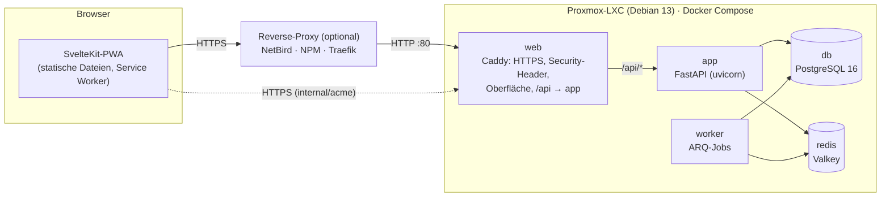
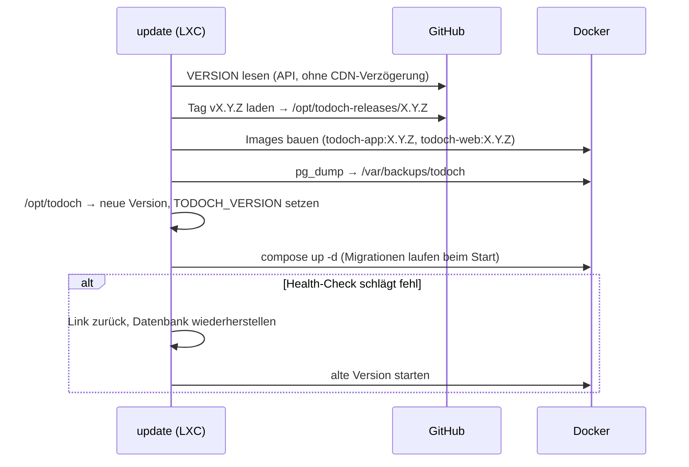

# Architektur

## Überblick

- **Netze:** `backend` ist ein internes Docker-Netz ohne Internet (db, redis, app, worker).
  `egress` verbindet web, app und worker mit der Außenwelt (später IMAP, OAuth, CalDAV).
- **Betriebsarten** (`TODOCH_TLS_MODE`): `proxy` (Caddy nur HTTP :80), `internal` (Caddy mit
  eigener CA, `/ca.crt` per HTTP), `acme` (Let's Encrypt). Siehe `deploy/caddy/`.

## Backend (`backend/app`)

| Modul | Aufgabe |
| --- | --- |
| `config.py` | Einstellungen aus `TODOCH_*`, Abbruch bei unsicheren Werten |
| `main.py` | App-Fabrik, Router, Fehlerbehandlung, Middleware |
| `security/middleware.py` | Security-Header, Größenlimit, Origin- und CSRF-Prüfung (reine ASGI-Middleware) |
| `security/sessions.py` | Serverseitige Sitzungen, Timeouts, Rotation, Cookies |
| `security/passwords.py`, `leaked.py` | Argon2id, Passwort-Richtlinie, Leak-Liste |
| `security/crypto.py` | AES-256-GCM mit Schlüsselbund und Kontext-Bindung, HMAC-Signaturen |
| `security/ratelimit.py` | Rate-Limits und Backoff in Redis |
| `policy.py` | Zentrale Autorisierung `can(user, action, obj)`, `visible_areas(user)` |
| `api/*` | REST-Endpunkte (`/api/auth`, `/api/areas`, `/api/tasks`, `/api/search`, `/api/setup`, `/api/meta`, `/api/health`) |
| `quickadd/parser.py` | Deutsche Schnellerfassung (Datum, Uhrzeit, Priorität, Tags, Bereich, Wiederholung) |
| `services/recurrence.py` | RRULE-Untermenge (FREQ, INTERVAL, BYDAY, UNTIL) |
| `markdown.py` | Markdown → HTML mit Allowlist (nh3) |
| `worker.py` | ARQ-Jobs (z. B. abgelaufene Sitzungen löschen) |
| `cli.py` | Verwaltung auf dem Server (`todoch users`, `reset-password`, `make-admin`) |

Datenmodell (M1): `users`, `user_sessions`, `audit_log` (nur anhängbar), `areas`, `tasks`
(Volltext-Spalte `search_vector`, Tags als Array), `task_checklist_items`. Migrationen mit Alembic;
sie laufen beim Start des App-Containers.

**Wiederholungen:** Beim Abhaken einer wiederkehrenden Aufgabe entsteht eine neue Aufgabe mit dem
nächsten Termin (nie in der Vergangenheit); die erledigte verliert ihre Regel. So gibt es keine
Duplikate und „Erledigt“ zeigt die tatsächliche Historie.

**Fälligkeit** ist ein „schwebendes“ Datum (+ optionale Uhrzeit) in der Zeitzone des Nutzers –
eine Aufgabe „am 15.10.“ bleibt am 15.10., egal wo man gerade ist.

## Frontend (`frontend/src`)

- SvelteKit im SPA-Modus (`adapter-static`, `ssr = false`), Svelte 5 Runes, Tailwind 4.
- Zustand in kleinen Stores (`lib/stores/*.svelte.ts`): Sitzung, Bereiche, UI (Dialoge,
  Änderungszähler), Hinweise. Listen laden neu, sobald sich Aufgaben ändern (`ui.version`).
- `lib/api.ts` schickt das CSRF-Token aus dem Cookie mit; 401 führt zur Anmeldung.
- Service Worker: App-Shell offline, GET-Antworten der API als Lesestand; wird beim An- und
  Abmelden geleert.
- CSP ohne Ausnahmen: `scripts/externalize-inline-scripts.mjs` lagert SvelteKits Startskript aus
  und entfernt den einzigen Inline-Style (siehe ADR 0002).

## Deployment und Updates

## Entscheidungen

Siehe [adr/](adr/): Stack, CSP ohne Nonces, Valkey statt Redis, Sitzungen und CSRF, Docker im LXC.
